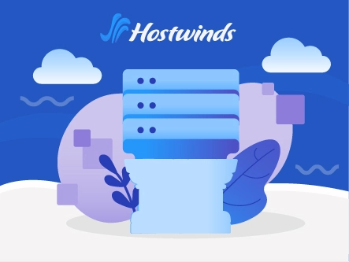
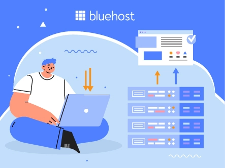

# 选对VPS主机，网站速度快十倍——12家顶级服务商实测对比

想让网站跑得飞快？想同时处理成千上万的访问？VPS主机就是答案。但问题来了——市面上那么多VPS服务商，怎么选才不踩坑？

别急，我花了几个月时间，把市面上主流的VPS服务商都测了个遍。从性能到价格，从技术支持到安全保护，该踩的坑我都替你踩过了。这篇文章会告诉你，哪些VPS真的值得买，哪些只是看起来美好。

---

**快速导航：**

1. **Kamatera** - 综合实力最强，企业级配置
2. **YouStable** - 新手友好，性价比之王
3. **InterServer** - 托管服务专家，省心之选
4. **UltaHost** - 无限流量，跑大流量网站首选
5. **ScalaHosting** - 可扩展性强，自带Spanel面板
6. **Liquidweb** - 速度狂魔，适合高性能需求
7. **Hosting.com** - 20倍速度提升，稳定可靠
8. **Hostwinds** - 全托管方案，适合不懂技术的人
9. **Bluehost** - NVMe SSD加持，WordPress专用
10. **Cloudways** - 云端灵活部署，支持多平台
11. **DigitalOcean** - 开发者最爱，低价高配
12. **Vultr** - SSD云服务器，全球32个机房

---

## 为什么要选VPS而不是共享主机？

用共享主机就像住集体宿舍——便宜是便宜，但隔壁老王半夜开party你也得跟着吵。VPS就不一样了，你有独立的房间，想怎么折腾就怎么折腾。

更重要的是，VPS给你专属的CPU、内存和存储空间。别人的网站崩了，你的照样稳如老狗。对于想认真做事的人来说，这点投资绝对值。

说到这里，👉 [如果你想快速上手高性能VPS，不妨试试Vultr的全球云服务器](https://www.vultr.com/?ref=9738262-9J)，32个数据中心随你选，部署起来特别快。

---

## 1. Kamatera - 企业级配置，30天免费试用

Kamatera最大的优势是什么？灵活。你想要什么配置，他们就给你什么配置。从1GB内存到几百GB，从1核CPU到几十核，全都能定制。

**核心优势：**
- **云端防火墙**：自动拦截DDoS攻击、恶意软件
- **智能负载均衡**：流量高峰期也不掉链子
- **24/7技术支持**：遇到问题秒回复
- **托管服务**：不懂技术也能玩转VPS

**价格方案：**
- 入门款：1GB RAM + 20GB SSD，$4/月
- 进阶款：2GB RAM + 30GB SSD，$6/月
- 专业款：3GB RAM + 40GB SSD，$12/月

**限时福利**：新用户可以免费试用30天，不需要信用卡。试完觉得不错再付费，不满意直接走人，零风险。

---

## 2. YouStable - 性价比之王，新手首选

YouStable用的是最新的NVMe SSD存储，速度比普通SSD快3-5倍。而且他们的CPU用的是Intel Xeon系列，处理多任务毫无压力。

**核心优势：**
- **多层DDoS防护**：黑客想搞你？门都没有
- **5GB免费网站迁移**：从别家搬过来，他们帮你搞定
- **KVM虚拟化**：资源100%独享，不和别人抢
- **免费SSL证书**：Let's Encrypt加密，网站更安全

**价格方案：**
- vStart：4GB RAM + 50GB NVMe，$5.41/月
- vProfessional：8GB RAM + 100GB NVMe，$6.99/月
- vPopular：16GB RAM + 200GB NVMe，$10.72/月

**限时优惠**：首年直接打5折，相当于半价用一整年。适合预算有限但想要好配置的朋友。

---

## 3. InterServer - 托管服务专家

不想折腾技术细节？InterServer的全托管方案就是为你准备的。他们会帮你搞定所有后台的事，你只管用就行。

**核心优势：**
- **SSD存储**：数据读写速度快
- **无限存储空间**：想存多少存多少
- **完全控制权**：需要的话也能自己调整
- **智能监控**：自动检测问题，提前修复

**价格方案：**
- 1片：2GB RAM + 1TB存储，$3/月
- 2片：4GB RAM + 2TB存储，$6/月
- 4片：8GB RAM + 4TB存储，$12/月

**限时福利**：用优惠码GRABPENNY，前3个月只要$1。这价格，试错成本基本为零。

---

## 4. UltaHost - 无限流量，适合大流量网站

如果你的网站流量很大，或者打算做视频、直播这种吃带宽的业务，UltaHost的无限流量方案就很合适。

**核心优势：**
- **无限带宽**：流量再大也不怕
- **可扩展架构**：业务增长了随时升级
- **免费Cloudflare CDN**：全球加速，哪里都快
- **内置安全防护**：自动拦截恶意访问

**价格方案：**
- 基础版：1核 + 1GB RAM + 30GB NVMe，$5.50/月
- 商务版：2核 + 2GB RAM + 50GB NVMe，$9.50/月
- 专业版：3核 + 4GB RAM + 75GB NVMe，$16.50/月

**限时优惠**：新用户可享30% OFF，用优惠码GOOGIEHOST再减7%。

想要真正意义上的高速体验？👉 [Vultr的NVMe SSD云服务器](https://www.vultr.com/?ref=9738262-9J)能给你稳定的性能输出，特别适合跑大型应用。

---

## 5. ScalaHosting - 自带Spanel，可视化管理

ScalaHosting最大的特点是他们自己开发的Spanel控制面板。比cPanel好用，而且功能更强大。

**核心优势：**
- **NVMe SSD存储**：速度比普通SSD快好几倍
- **Spanel面板**：操作简单，几次点击就搞定
- **实时恶意软件扫描**：自动检测威胁
- **一键应用安装**：WordPress、Joomla等常用程序秒装

**价格方案：**
- Build #1：2核 + 4GB RAM + 50GB NVMe，$29.95/月
- Build #2：4核 + 8GB RAM + 100GB NVMe，$63.95/月
- Build #3：8核 + 16GB RAM + 150GB NVMe，$121.95/月

**限时优惠**：现在下单可享36% OFF，用优惠码GOOGIEHOST再减10%。

---

## 6. Liquidweb - 速度狂魔

Liquidweb用的是最新的Intel Xeon E5处理器配SSD存储，速度快到你怀疑人生。

**核心优势：**
- **Intel Xeon E5处理器**：性能爆表
- **Cloudflare CDN**：全球加速
- **完全root权限**：想怎么配置就怎么配置
- **轻松扩展**：业务增长了随时升级

**价格方案：**
- 2GB方案：1核 + 30GB SSD + 1TB流量，$5/月
- 24GB方案：6核 + 540GB SSD + 8TB流量，$61.50/月
- 32GB方案：8核 + 640GB SSD + 10TB流量，$89.50/月

**限时优惠**：用优惠码LW25CLOUD，托管方案前4个月享25% OFF。

---

## 7. Hosting.com - 20倍速度提升

Hosting.com最大的卖点是速度——他们承诺比普通主机快20倍。这不是吹牛，是因为他们用的NVMe SSD存储配合高性能CPU。

**核心优势：**
- **NVMe SSD存储**：数据传输速度超快
- **企业级安全**：免费SSL、防火墙、DDoS防护
- **站内+站外备份**：数据双重保护
- **全托管服务**：不懂技术也能用

**价格方案：**
- VPS XS：2核 + 4GB RAM + 80GB存储，$33/月
- VPS S：4核 + 8GB RAM + 160GB存储，$38.50/月
- VPS M：8核 + 16GB RAM + 320GB存储，$40.50/月

**限时优惠**：新用户享50% OFF，现在入手正是好时机。

---

## 8. Hostwinds - 全托管，省心省力

Hostwinds的全托管方案适合那些不想碰技术细节的人。他们会帮你搞定所有的后台配置和维护。

**核心优势：**
- **SSD存储**：数据读写快
- **强大的防火墙**：阻挡恶意攻击
- **完整的DDoS防护**：网站始终在线
- **99.99%在线率保证**：几乎不宕机

**价格方案：**
- 方案1：1核 + 1GB RAM + 30GB存储，$12.74/月
- 方案2：1核 + 2GB RAM + 40GB存储，$20.99/月
- 方案3：2核 + 4GB RAM + 75GB存储，$34.49/月

**限时优惠**：全托管方案享50% OFF，算下来很划算。

---

## 9. Bluehost - WordPress专用优化

如果你用WordPress建站，Bluehost是个不错的选择。他们对WordPress做了专门优化，速度和稳定性都很好。

**核心优势：**
- **免费CDN**：全球访问更快
- **多服务器管理**：一个面板管理所有网站
- **RAID存储**：数据安全有保障
- **root权限**：完全控制你的服务器

**价格方案：**
- Standard NVMe 4：2核 + 4GB DDR5 + 100GB NVMe，$46.99/月
- Enhanced NVMe 8：4核 + 8GB DDR5 + 200GB NVMe，$65.99/月
- Ultimate NVMe 16：8核 + 16GB DDR5 + 450GB NVMe，$95.99/月

**限时优惠**：VPS方案享50% OFF折扣。

---

## 10. Cloudways - 云端灵活部署

Cloudways不是传统的VPS服务商，他们是云平台的托管服务。你可以选择在DigitalOcean、AWS、Vultr等平台上部署，他们帮你管理。

**核心优势：**
- **内置安全防护**：机器人防护、双因素认证
- **Cloudflare集成**：自动CDN加速和DDoS防护
- **测试环境**：改动先在测试环境试，安全稳妥
- **智能备份**：自动备份你的网站

**价格方案：**
- 方案1：1核 + 1GB RAM + 25GB存储，$12/月
- 方案2：2核 + 4GB RAM + 80GB存储，$50/月
- 方案3：1核 + 2GB RAM + 50GB存储，$26/月

**限时优惠**：新用户享3天免费试用，不需要信用卡。

---

## 11. DigitalOcean - 开发者最爱

DigitalOcean是开发者圈子里的宠儿。他们的云服务器配置灵活，而且价格便宜。

**核心优势：**
- **可扩展方案**：随时升级配置
- **一键安装应用**：WordPress、Node.js等常用工具秒装
- **丰富的市场**：各种应用和工具任你选
- **托管服务**：通过Cloudways可以获得托管支持

**价格方案：**
- 方案1：1核 + 1GB RAM + 25GB存储，$12/月
- 方案2：2核 + 4GB RAM + 80GB存储，$50/月
- 方案3：1核 + 2GB RAM + 50GB存储，$26/月

**限时优惠**：新用户获赠$200免费额度，足够你用好几个月。

---

## 12. Vultr - 全球32个数据中心

Vultr的最大优势是机房多——全球32个数据中心，你可以选择离你用户最近的节点，保证访问速度。

**核心优势：**
- **NVMe SSD存储**：数据读写超快
- **32个全球机房**：哪里的用户都能快速访问
- **丰富的操作系统**：Linux、Windows、Debian随便选
- **高性能GPU**：跑AI应用也没问题

**价格方案：**
- 方案1：1核 + 1GB RAM + 25GB存储，$5/月
- 方案2：1核 + 2GB RAM + 55GB存储，$10/月
- 方案3：2核 + 4GB RAM + 80GB存储，$20/月

**限时优惠**：新用户获赠$50免费额度，够你试用好一阵子。

---

## 怎么选VPS才不踩坑？

选VPS，别光看价格，这几点更重要：

**1. 硬件配置要过硬**
- 优先选NVMe SSD，比普通SSD快3-5倍
- CPU最好是Intel Xeon或同级别
- 内存至少4GB起步，8GB更好

**2. 技术支持要靠谱**
- 必须有24/7在线客服
- 响应时间不能超过5分钟
- 最好有中文支持（如果你英语不好）

**3. 可扩展性要好**
- 业务增长了能轻松升级
- 不要被锁死在一个配置上

**4. 安全措施要到位**
- DDoS防护是标配
- 免费SSL证书很重要
- 自动备份不能少

说到全球覆盖和性能稳定，👉 [Vultr的云服务器](https://www.vultr.com/?ref=9738262-9J)在这方面做得相当不错，32个机房任你选，部署快、性能稳。

---

## 常见问题解答

**VPS主机安全吗？**
只要选对服务商，VPS是非常安全的。上面推荐的这些都有完整的安全措施——DDoS防护、防火墙、SSL证书一个不少。

**为什么VPS比共享主机贵？**
贵是因为好。VPS给你独立的资源，不和别人抢。共享主机就像挤公交，VPS就像开私家车，体验完全不同。

**新手适合用VPS吗？**
当然可以。像YouStable、Hostwinds这些提供全托管服务，不懂技术也能用。而且他们的客服很给力，有问题随时帮你搞定。

**VPS和云主机有什么区别？**
VPS是在一台物理服务器上虚拟出多个独立服务器。云主机是多台服务器组成一个集群，你的网站同时存在于多台机器上，更稳定。

**VPS比共享主机快多少？**
快很多。因为VPS的CPU、内存、存储都是独享的，不受其他用户影响。实际使用中，速度提升至少5-10倍。

---

## 总结：选哪个最合适？

说了这么多，到底选哪个？我的建议是：

- **预算充足，追求性能**：选Kamatera或Liquidweb
- **新手入门，性价比优先**：选YouStable或InterServer
- **大流量网站**：选UltaHost或Hosting.com
- **开发者、技术流**：选DigitalOcean或Vultr
- **不想碰技术细节**：选Hostwinds或Cloudways

这12家都是经过市场检验的靠谱服务商，不管选哪个都不会太差。关键是根据你的实际需求来选——预算多少？技术水平如何？网站类型是什么？想清楚这些，就知道该选哪个了。

最后说一句：别纠结太久。VPS这东西，试了才知道合不合适。大部分服务商都有试用期或退款保证，先试用再说，不行就换，这才是最聪明的做法。
